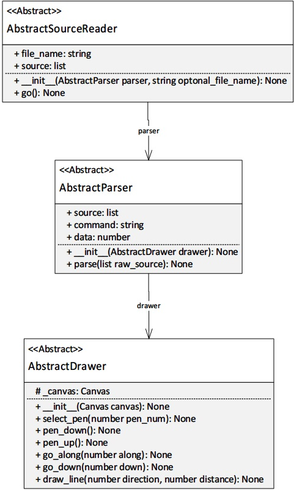

# PR301_Code_Refactoring
 [Full Self-marking Sheet](Documents/BCPR301_Assignment2_self-marking%20sheet_YuHong.Jhuo_99140202.docx)

 [Interface Diagram](Documents/Interface_Diagram.jpg)
## Interface Diagram

## Feature List
-	User can select pen
-	User can put pen down
-	User can move pen up
-	User can move the pen horizontally (go along)
-	User can move the pen vertically (go down)
-	User can draw a line with input direction and distance
-	The system can read commands from text file
-	The system can parse the commands from text file

## Worst bad smells before refactoring
-	Lazy Class in AbstractSourceReader.
-	Inappropriate Intimacy between frontends and parsers.
-	Shotgun Surgery in the drawers and frontends.
-	Alternative Classes with Different Interfaces in two frontends.
-	Switch statement in the drawers and the parsers.
-	Refused-bequest in MainTIGr.
-	Long methods in frontends

## Refactoring  1
### Name
Lazy Class 
### Location
- refactored_code
   - source_reader_kieran.py 
        - Whole MainTIGr class
   - tigr.py
        - AbstractSourceReader line 48~62

## Refactoring 2
### Name
Alternative Classes with Different Interfaces
### Location
- refactored_code
    - front_end_jerry.py
        - GuiInterface whole class
    - front_end_kieran.py 
        - TkinterInterface whole class

## Refactoring 3
### Name
Long methods 
### Location: 
- refactored_code
    - front_end_jerry.py
        - GuiInterface
            - init_widgets() line 19~79
         
